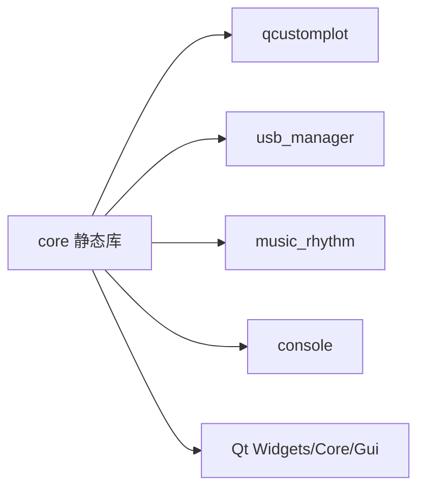
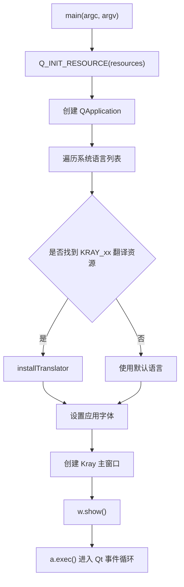
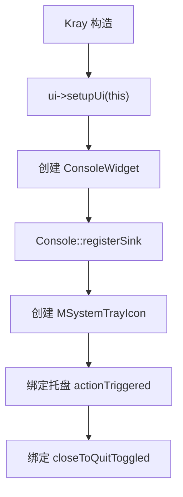
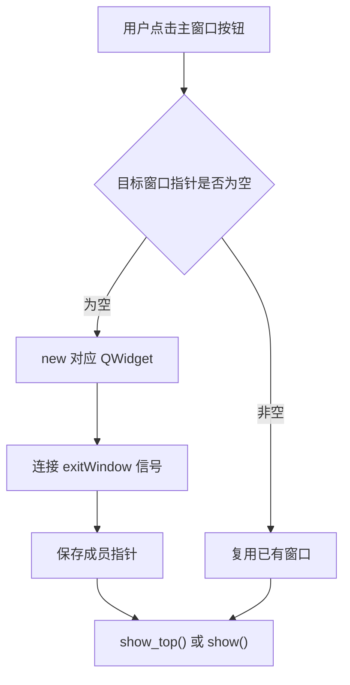
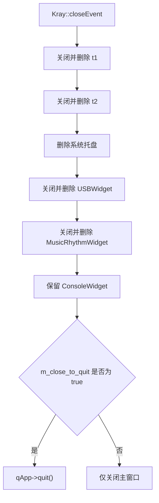

<!-- 本文件用于说明 src/core 模块的职责、窗口调度逻辑和启动流程。 -->

# core 模块逻辑说明

## 模块职责

`src/core` 是应用的主壳模块，负责：

- 定义应用入口 `main.cpp`
- 创建 Qt 应用对象、加载资源和翻译
- 创建并显示 `Kray` 主窗口
- 通过主窗口按钮懒加载各功能窗口
- 管理部分子窗口的关闭和释放

核心文件：

- `src/core/main.cpp`
- `src/core/kray.h`
- `src/core/kray.cpp`
- `src/core/kray_msg.cpp`
- `src/core/t1.cpp`
- `src/core/t2.cpp`

## 构建依赖

## 启动流程

## 主窗口逻辑

`Kray` 构造函数主要做三件事：

1. 初始化 UI、标题和图标。
2. 创建全局控制台窗口 `_consoleWin` 并注册日志 sink。
3. 创建系统托盘图标，并绑定“显示”和“退出”动作。

## 子窗口懒加载流程

按钮与窗口关系：

| 按钮槽函数 | 创建对象 | 说明 |
| --- | --- | --- |
| `on_btn_console_clicked()` | `_consoleWin` | 显示日志控制台 |
| `on_btn_usb_clicked()` | `USBWidget` | USB 设备管理 |
| `on_btn_music_clicked()` | `MusicRhythmWidget` | 音乐律动窗口 |
| `on_btn_t1_clicked()` | `T1` | libusb 和图表测试页 |
| `on_btn_t2_clicked()` | `T2` | 占位测试页 |
| `on_btn_audio_clicked()` | 无 | 当前为空实现 |

## 关闭流程

## 当前状态

- 主窗口已经承担应用总调度职责。
- 子窗口采用懒加载，避免启动时创建所有功能窗口。
- `main.cpp` 被编入 `core` 静态库，最终可执行文件通过链接 `core` 获得入口。
- 关闭逻辑中存在多处手动释放对象。

## 改进建议

1. 将 `main.cpp` 从 `core` 静态库中拆回可执行目标，构建结构会更直观。
2. 提取 `cleanupChildWindows()`，避免 `closeEvent` 和析构函数重复释放同一批成员。
3. 优先使用 Qt 父子对象所有权或 `deleteLater()`，减少手写 `delete`。
4. `on_btn_audio_clicked()` 当前为空，应删除按钮、隐藏入口或补齐功能。
5. `_consoleWin` 当前是文件级静态变量，后续可改为 `Kray` 成员或日志服务对象。
