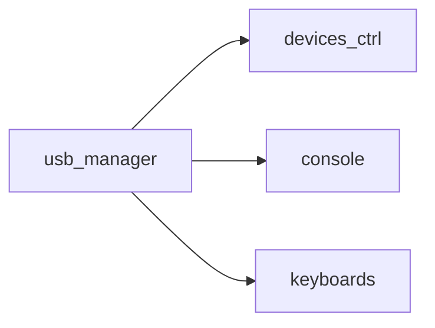
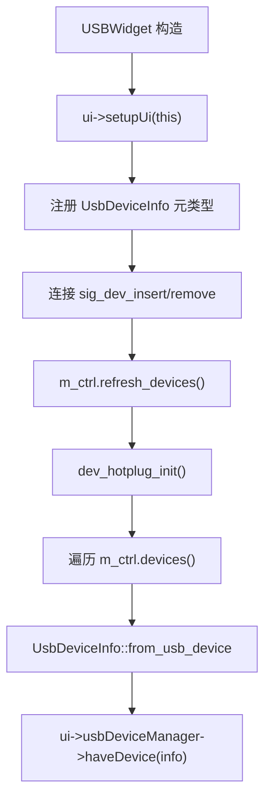
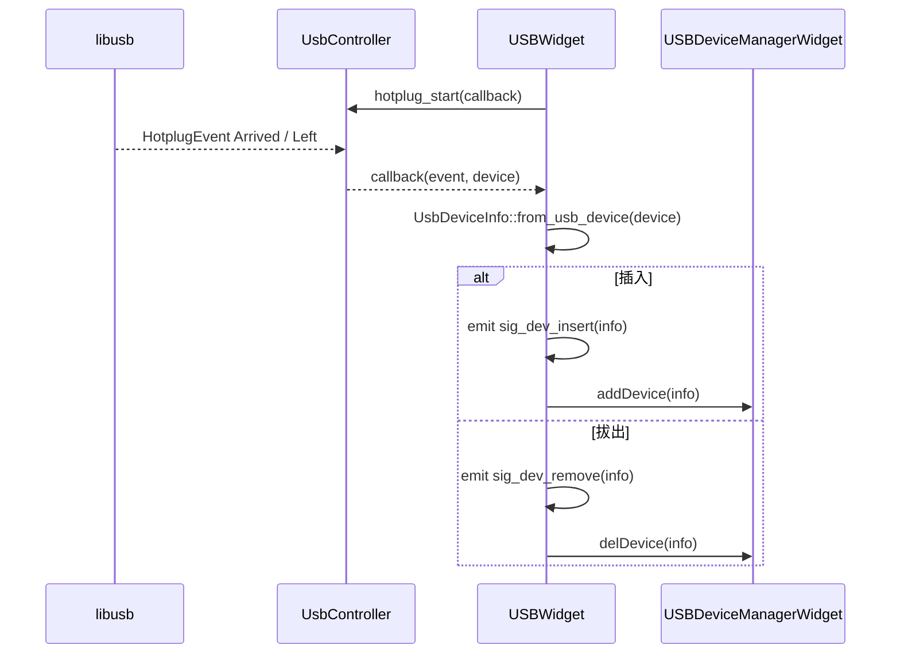
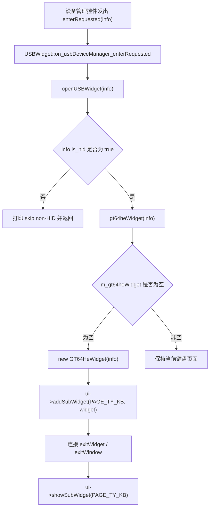
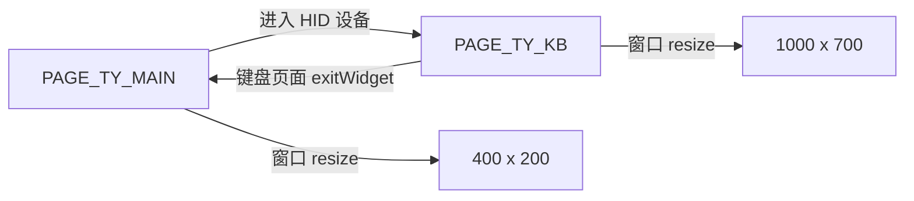

<!-- 本文件用于说明 src/ui/usb_manager 模块的 USB 设备管理与页面切换流程。 -->

# usb_manager 模块逻辑说明

## 模块职责

`src/ui/usb_manager` 是 USB 功能入口，负责：

- 创建 `UsbController` 并刷新当前 USB 设备列表
- 启动 USB 热插拔监听
- 将设备信息展示到设备管理控件
- 响应用户进入设备的请求
- 创建并展示 GT-64HE 键盘控制页面

核心文件：

- `src/ui/usb_manager/USBWidget.cpp`
- `src/ui/usb_manager/USBWidgetSlots.cpp`
- `src/ui/usb_manager/USBWidget.h`
- `src/ui/usb_manager/USBDeviceManagerWidget.*`
- `src/ui/usb_manager/Ui_USBWidget.*`

## 构建依赖

## 初始化流程

## 热插拔流程

## 进入键盘页面流程

## 页面切换流程

## 当前状态

- 已完成设备枚举、热插拔通知和设备列表更新。
- 已能从设备列表进入键盘控制页面。
- 只支持单个 `m_gt64heWidget` 实例。
- `closeUSBWidget()` 当前为空实现。
- `openUSBWidget()` 只判断是否 HID，没有校验 GT-64HE 的 VID/PID。

## 改进建议

1. 在 `openUSBWidget()` 中增加 `GT64HeDevice::VID` 和 `GT64HeDevice::PID` 校验。
2. 补齐 `closeUSBWidget()`，拔出当前设备时应关闭对应页面并释放设备。
3. 如果后续支持多设备，应将 `m_gt64heWidget` 从单指针改为按设备 ID 管理的映射。
4. 热插拔回调来自 USB 事件线程时，应确保 UI 更新始终通过 Qt queued connection 回到主线程。
5. 设备列表应展示设备类型、VID/PID、产品名和可进入状态，避免用户误点非目标设备。
