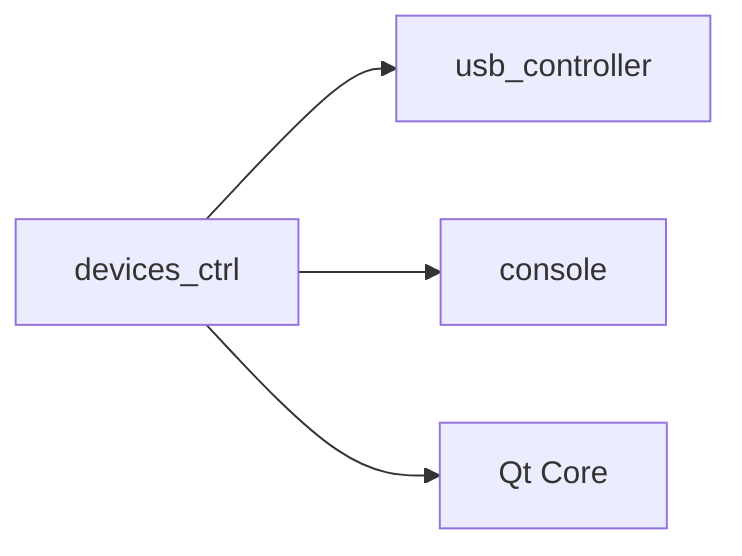
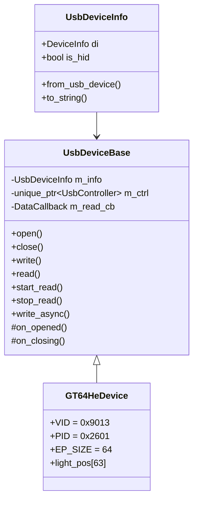
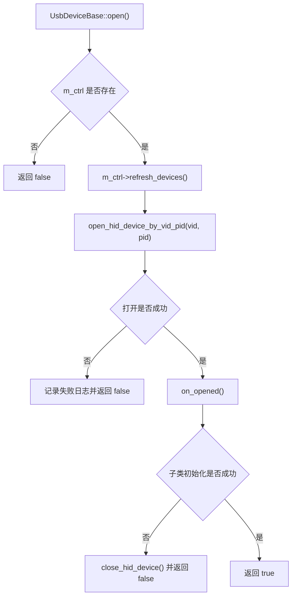
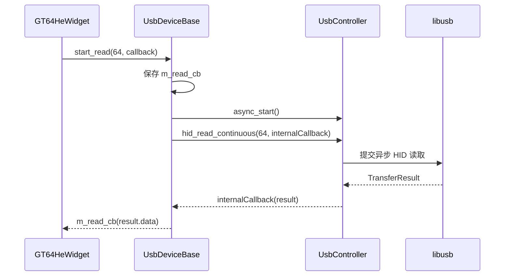
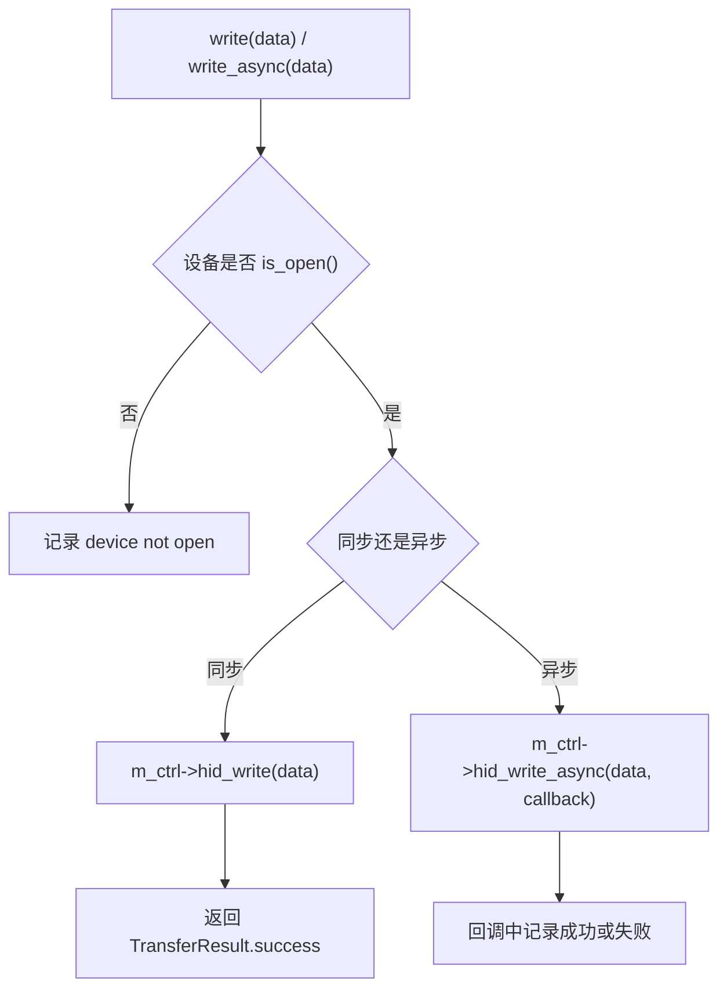

<!-- 本文件用于说明 src/ui/devices_ctrl 模块的 Qt 设备封装和 USB 操作模板流程。 -->

# devices_ctrl 模块逻辑说明

## 模块职责

`src/ui/devices_ctrl` 位于 UI 与底层 USB 控制库之间，负责：

- 将底层 `usb_ctrl::core::UsbDevice` 转换为 Qt 层可传递的 `UsbDeviceInfo`
- 封装通用 USB 设备打开、关闭、读写流程
- 为 GT-64HE 定义设备常量、接口编号和灯位映射

核心文件：

- `src/ui/devices_ctrl/usb_device_info.hpp`
- `src/ui/devices_ctrl/usb_device_base.hpp`
- `src/ui/devices_ctrl/usb_device_base.cpp`
- `src/ui/devices_ctrl/gt64he_device.hpp`
- `src/ui/devices_ctrl/gt64he_device.cpp`

## 构建依赖

## 设计角色

## 打开设备流程

## 异步读取流程

## 写入流程

## GT-64HE 设备信息

| 常量 | 值 | 说明 |
| --- | --- | --- |
| `VID` | `0x9013` | 厂商 ID |
| `PID` | `0x2601` | 产品 ID |
| `EP_SIZE` | `64` | HID 报告长度 |
| `INTERFACE_KEYBOARD` | `0` | 键盘接口 |
| `INTERFACE_LAMP` | 枚举值 | 灯效接口，当前尚未真正使用 |

## 当前状态

- `UsbDeviceBase` 已经形成模板方法结构。
- `GT64HeDevice` 目前主要提供常量和灯位表，没有复杂设备命令封装。
- 读写接口仍直接传输原始字节，没有和 HPHPT 协议层强绑定。

## 改进建议

1. 在 `GT64HeDevice` 中增加明确的业务方法，例如 `sendLightFrame()`、`readDeviceAttr()`。
2. 将协议封包逻辑放在设备类或专门的 protocol adapter 中，避免 UI 层直接拼字节。
3. `light_pos` 建议改为 `static constexpr std::array`，避免每个实例都持有一份固定表。
4. 增加接口选择能力，当前 `open_hid_device_by_vid_pid()` 只按 VID/PID 找第一个 HID。
5. 对异步回调对象生命周期做防护，避免窗口销毁后底层回调访问悬空 `this`。
