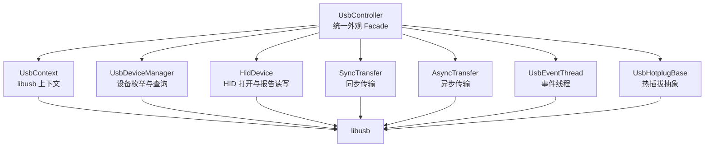
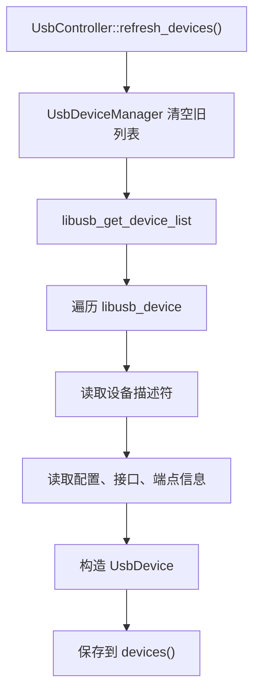
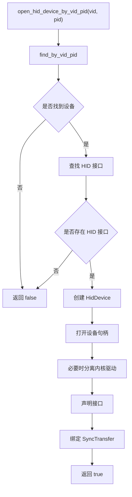
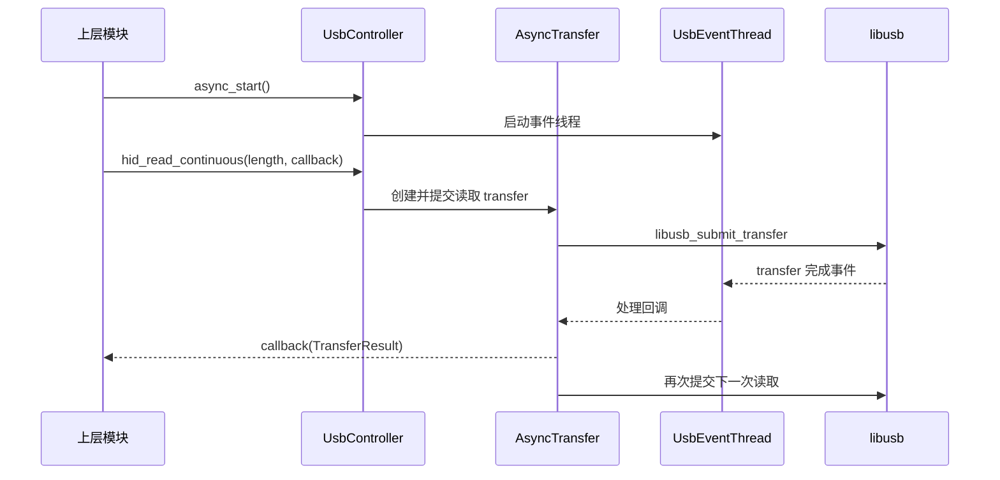
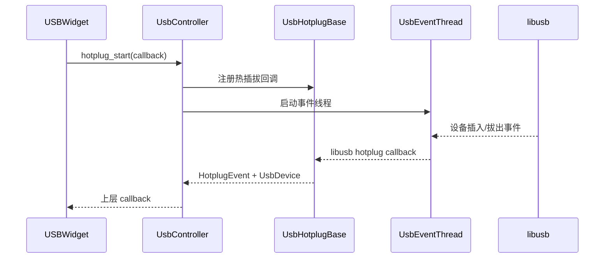

<!-- 本文件用于说明 src/usb_controller 模块的 libusb 封装、设备管理和传输流程。 -->

# usb_controller 模块逻辑说明

## 模块职责

`src/usb_controller` 是项目的 USB 底层控制库，负责屏蔽 libusb 的复杂细节，对上层提供统一接口。

主要能力：

- 初始化和释放 libusb 上下文
- 枚举 USB 设备
- 查找 HID 设备
- 打开和关闭 HID 设备
- 执行同步读写
- 执行异步读写和连续读取
- 监听设备热插拔

核心文件：

- `src/usb_controller/src/usb_controller.hpp`
- `src/usb_controller/src/usb_controller.cpp`
- `src/usb_controller/src/usb_core/*`
- `src/usb_controller/src/usb_io/*`
- `src/usb_controller/doc.md`

## 内部结构

## 设备枚举流程

## HID 打开流程

## 异步连续读取流程

## 热插拔流程

## 对外 API 分类

| 分类 | 代表 API | 说明 |
| --- | --- | --- |
| 基础设置 | `set_debug_level()`、`refresh_devices()` | 初始化和刷新 |
| 设备查询 | `devices()`、`find_by_vid_pid()`、`find_hid_devices()` | 获取设备信息 |
| HID 操作 | `open_hid_device_by_vid_pid()`、`hid_read()`、`hid_write()` | HID 报告读写 |
| 同步传输 | `bulk_read()`、`interrupt_write()` | 通用传输 |
| 异步传输 | `hid_read_continuous()`、`hid_write_async()` | 后台读写 |
| 热插拔 | `hotplug_start()`、`hotplug_stop()` | 插拔监听 |

## 当前状态

- 底层 USB 封装相对完整，并且已有独立 `doc.md`。
- 上层主要通过 HID API 使用该模块。
- 热插拔能力已接入 `USBWidget`。
- 异步连续读取已接入键盘调试页面。

## 改进建议

1. 为 `TransferResult` 增加更结构化的错误码，减少仅依赖字符串判断。
2. 明确异步引擎与热插拔事件线程的关系，避免重复启动或关闭顺序问题。
3. 为 HID 接口选择提供更细控制，例如按接口号或端点能力选择。
4. 增加 mock 或 fake backend，方便无设备环境下测试 UI 和协议逻辑。
5. 将 `src/usb_controller/doc.md` 的成熟内容整合到项目总文档中。
