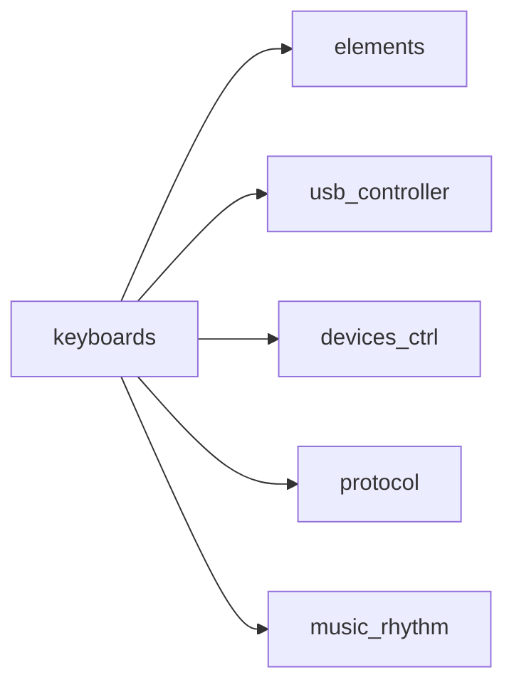
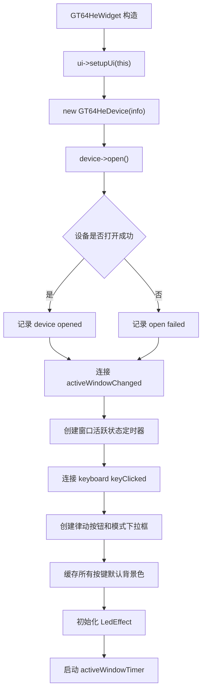
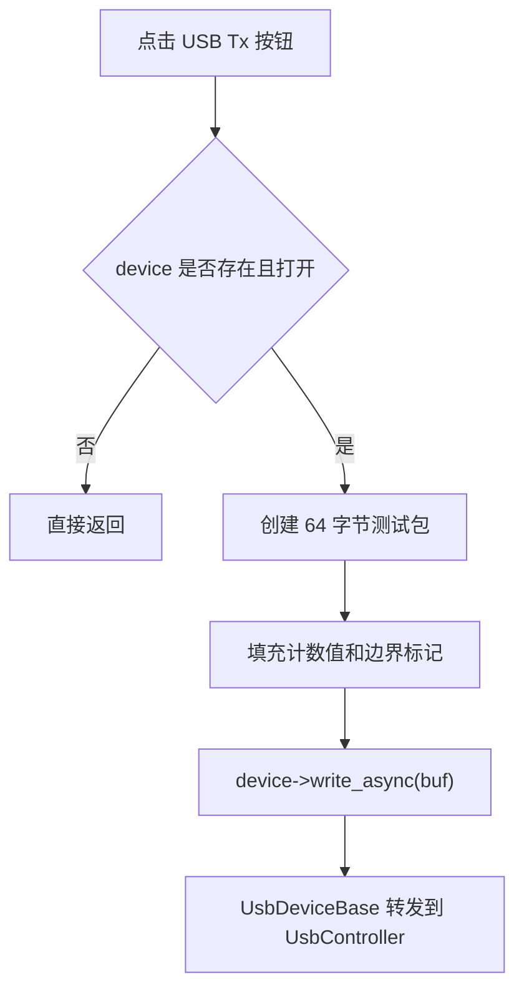
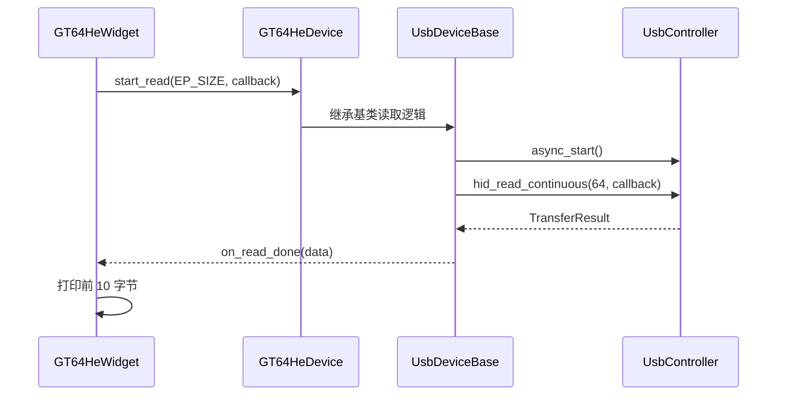
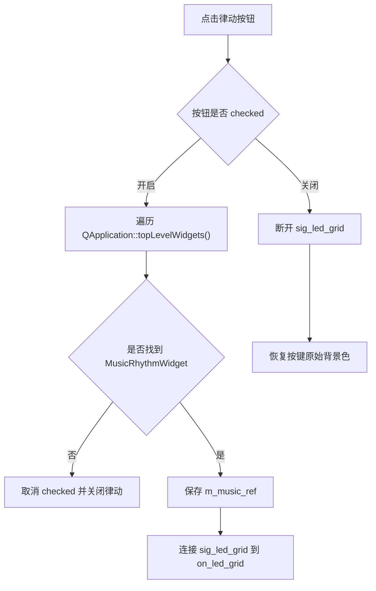
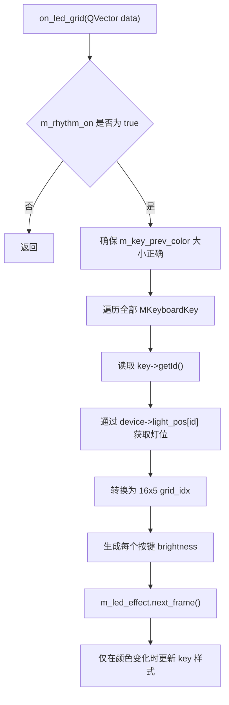

<!-- 本文件用于说明 src/ui/keyboards/ray 模块的 GT-64HE 键盘页面、调试收发和灯效联动流程。 -->

# keyboards/ray 模块逻辑说明

## 模块职责

`src/ui/keyboards/ray` 是 GT-64HE 键盘的专属 UI 与业务模块，负责：

- 创建和管理键盘可视化页面
- 打开 `GT64HeDevice`
- 提供 USB 调试发送和连续接收
- 响应键盘按键 UI 点击
- 管理参数面板和颜色调试
- 接收音乐律动 LED 网格并映射到按键颜色
- 调用 `LedEffect` 生成每一帧灯效颜色

核心文件：

- `src/ui/keyboards/ray/GT64HeWidget.h`
- `src/ui/keyboards/ray/GT64HeWidget.cpp`
- `src/ui/keyboards/ray/GT64HeWidgetSlots.cpp`
- `src/ui/keyboards/ray/LedEffect.h`
- `src/ui/keyboards/ray/LedEffect.cpp`

## 构建依赖

## 页面构造流程

## USB 调试发送流程

## USB 连续读取流程

## 音乐律动联动流程

## LED 网格映射流程

## LedEffect 模式

| 模式 | 说明 |
| --- | --- |
| `LED_FX_COLOR_CYCLE` | 所有灯统一色相随时间循环 |
| `LED_FX_RAINBOW` | 色相随时间和按键位置旋转 |
| `LED_FX_BREATHING` | 基础色按正弦亮度呼吸 |
| `LED_FX_WAVE` | 基础色按位置形成波浪 |
| `LED_FX_SPARKLE` | 随机位置星火闪烁 |
| `LED_FX_STATIC` | 固定基础色 |

## 当前状态

- 键盘 UI 和颜色调试能力较完整。
- USB 收发仍是调试包和原始字节打印。
- `hphpt.h` 已被包含，但没有真正调用 `hpt_decode()` 或 `hpt_encode()`。
- 音乐律动只影响 UI 按键背景色，没有下发到物理键盘。
- `device->light_pos[id]` 假设 key id 总是合法，缺少边界检查。

## 改进建议

1. 将 USB Tx/Rx 从调试字节流切换为 HPHPT 协议帧。
2. 在 `on_read_done()` 中调用 `hpt_decode()`，并根据命令回调更新 UI 状态。
3. 在 `on_led_grid()` 中校验 key id 是否小于 `light_pos` 长度。
4. 将 UI 灯效结果转换为灯效协议包，通过 `INTERFACE_LAMP` 下发到物理键盘。
5. 将律动窗口依赖改为显式注入，避免顶层窗口遍历带来的不确定性。
6. 将大量颜色调试槽函数抽出公共方法，减少重复代码。
