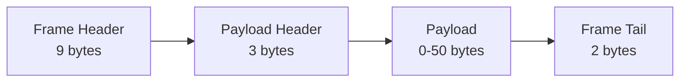
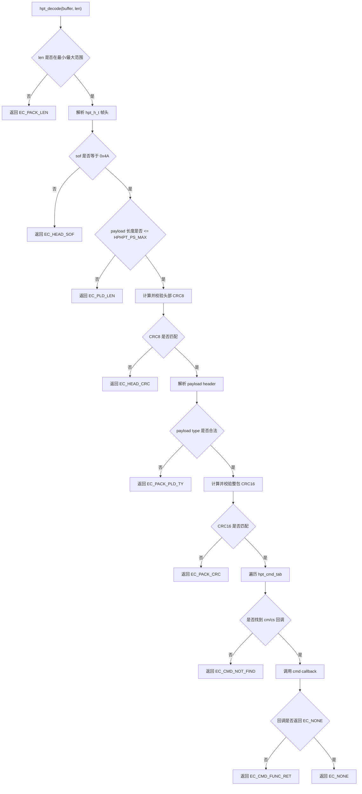
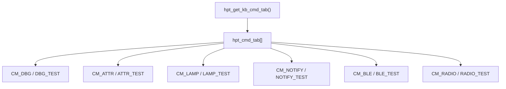

<!-- 本文件用于说明 src/protocol 模块的 HPHPT 协议帧结构、解码流程和当前缺口。 -->

# protocol 模块逻辑说明

## 模块职责

`src/protocol` 定义 HPHPT 协议框架，目标是为 PC 与键盘设备之间的 64 字节 HID 通信提供统一编解码能力。

主要职责：

- 定义固定 64 字节帧结构
- 定义帧头、载荷头、载荷区、帧尾偏移
- 校验 SOF、payload 长度、payload 类型
- 校验头部 CRC8 和整包 CRC16
- 按 `cm/cs` 查找命令表并执行回调

核心文件：

- `src/protocol/hphpt.h`
- `src/protocol/hphpt.cpp`
- `src/protocol/hphpt_cmd.cpp`

## 构建依赖

## 协议帧结构

| 区域 | 偏移 | 长度 | 字段 |
| --- | --- | --- | --- |
| Frame Header | `0` | `9` | `sof`、`seq`、`rsv`、`pl`、`crc8` |
| Payload Header | `9` | `3` | `cm`、`cs`、`ty` |
| Payload | `12` | 最大 `50` | 业务数据 |
| Frame Tail | `12 + payload_size` | `2` | `crc16` |

## 解码流程

## 命令分发表

当前所有命令回调都只是返回 `EC_NONE`，尚未解析 payload 或驱动业务状态。

## 当前状态

- 帧格式和解码骨架已存在。
- 命令分发表已存在。
- CRC8、CRC16 当前返回固定 `0`。
- `hpt_encode()` 当前未真正实现。
- 键盘 UI 当前没有把收发数据接入该协议。

## 改进建议

1. 实现 `hpt_crc_head()` 和 `hpt_crc_full()`，明确多字节字段大小端。
2. 补齐 `hpt_encode()`，入参应包含 `cm`、`cs`、`payload type`、payload 数据和序列号。
3. 将 `head->pl` 的语义统一清楚：它应表示 payload 数据长度，还是 payload header + payload 的总长度。
4. 命令回调应接收结构化上下文，而不只是裸 `payload` 指针。
5. 在 `GT64HeWidget::on_read_done()` 中接入 `hpt_decode()`。
6. 为 `CM_LAMP` 增加灯效下发命令，实现 UI 灯效到物理键盘的闭环。
7. 为协议层增加单元测试，覆盖长度、SOF、CRC、类型、未知命令等失败路径。
