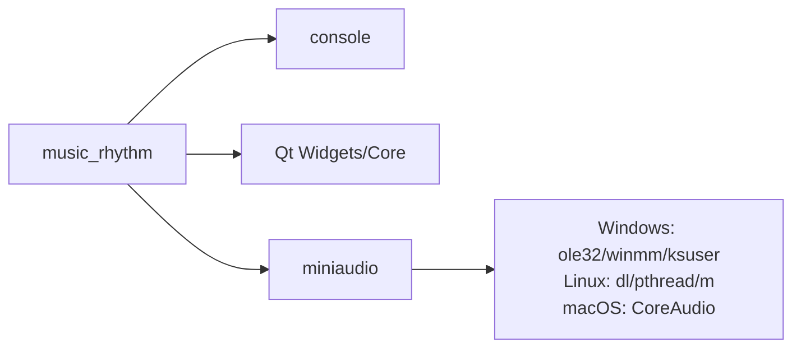
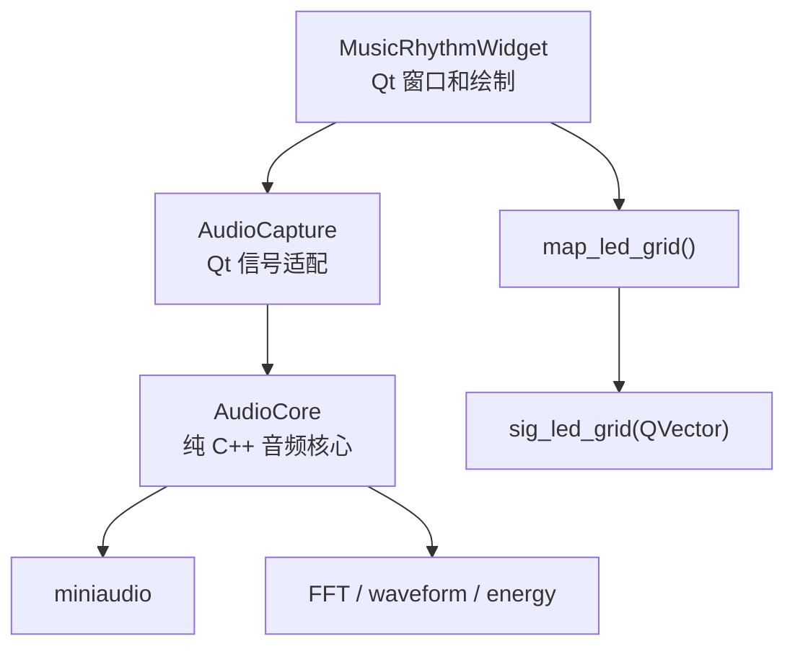
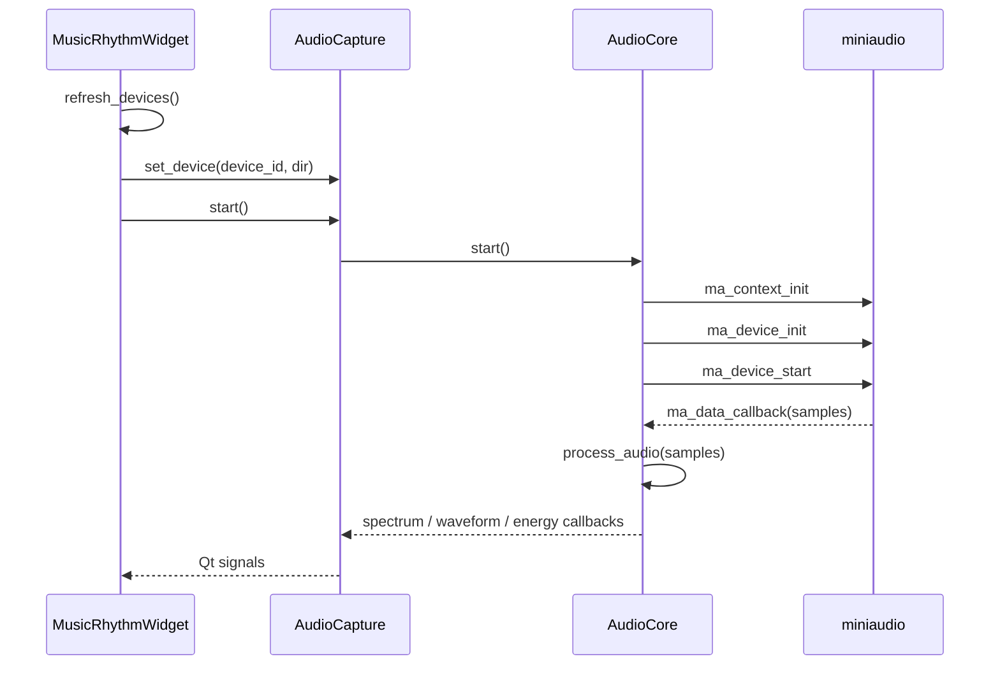
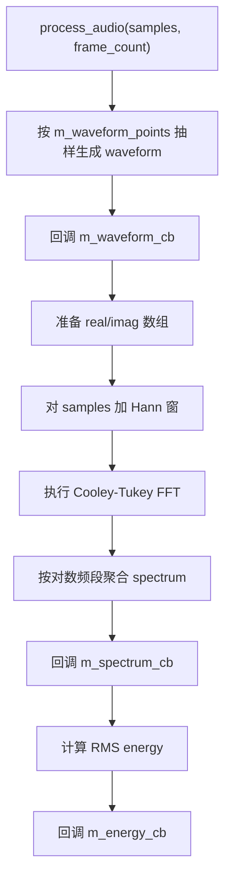
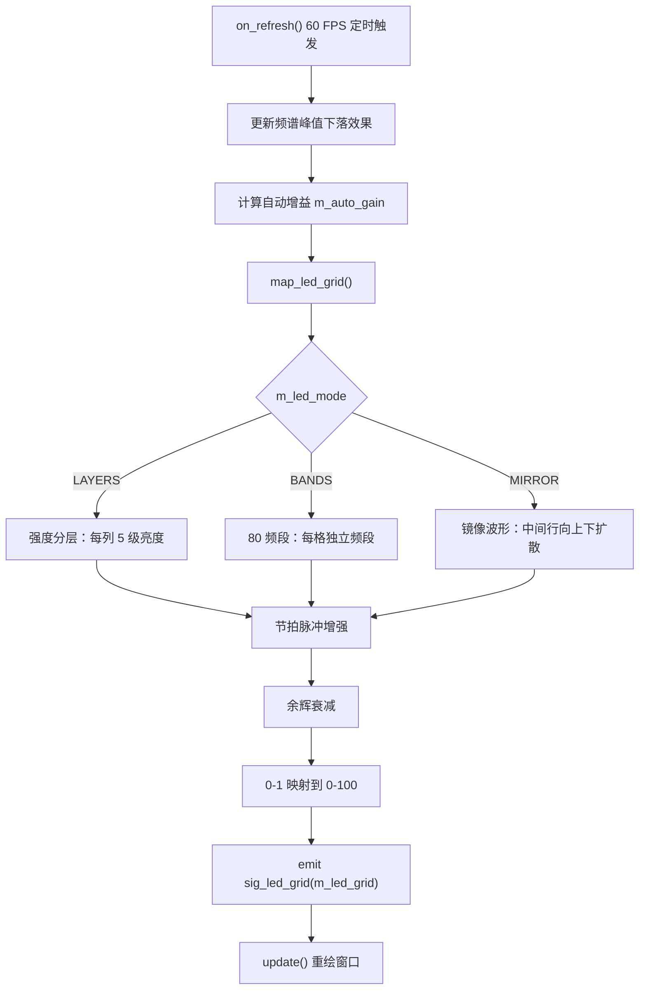

<!-- 本文件用于说明 src/ui/music_rhythm 模块的音频采集、频谱分析和 LED 网格映射流程。 -->

# music_rhythm 模块逻辑说明

## 模块职责

`src/ui/music_rhythm` 是音乐律动模块，负责：

- 枚举系统音频输入/输出设备
- 使用 miniaudio 采集音频
- 对音频数据做波形、频谱和能量分析
- 将频谱映射为 16×5 LED 网格
- 绘制频谱、波形、能量条和 LED 网格预览
- 通过 Qt 信号将 LED 网格发送给键盘页面

核心文件：

- `src/ui/music_rhythm/AudioCore.h`
- `src/ui/music_rhythm/AudioCore.cpp`
- `src/ui/music_rhythm/AudioCapture.h`
- `src/ui/music_rhythm/AudioCapture.cpp`
- `src/ui/music_rhythm/MusicRhythmWidget.h`
- `src/ui/music_rhythm/MusicRhythmWidget.cpp`
- `src/ui/music_rhythm/miniaudio.h`

## 构建依赖

## 模块内部结构

## 音频采集流程

## 音频处理流程

## LED 网格映射流程

## 对外信号

| 信号 | 数据 | 用途 |
| --- | --- | --- |
| `sig_spectrum` | `QVector<float>` | 频谱数据 |
| `sig_waveform` | `QVector<float>` | 波形数据 |
| `sig_energy` | `float` | 总能量 |
| `sig_led_grid` | `QVector<float>`，80 个值 | 16×5 LED 亮度网格 |

## 当前状态

- miniaudio 采集链路完整。
- 支持输出设备 loopback 和输入设备 capture。
- 频谱、波形、能量和 LED 网格都有 UI 预览。
- LED 网格已经能通过信号传递给 `GT64HeWidget`。
- 自动增益策略直接影响视觉和灯效，但暂未抽象成可测试组件。

## 改进建议

1. 将 FFT 和 LED 映射逻辑拆成纯函数或独立类，便于单元测试。
2. 为 `m_bar_count`、`m_waveform_points` 增加范围保护，避免极端 UI 设置造成性能问题。
3. 明确刷新频率和音频回调线程之间的数据同步策略，减少数据竞争风险。
4. 将增益、余辉、节拍检测参数集中成配置结构。
5. 增加“无音频设备”或“采集失败”的 UI 提示，而不是只输出 `qDebug()`。
