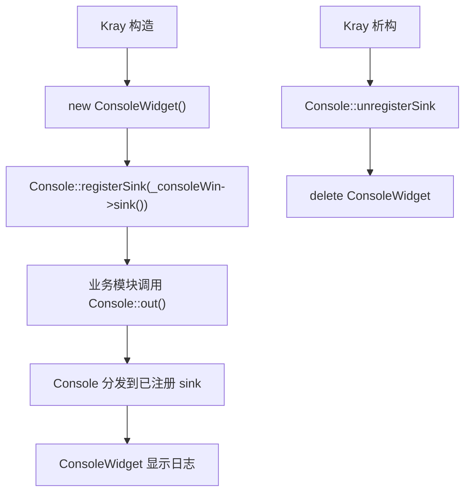
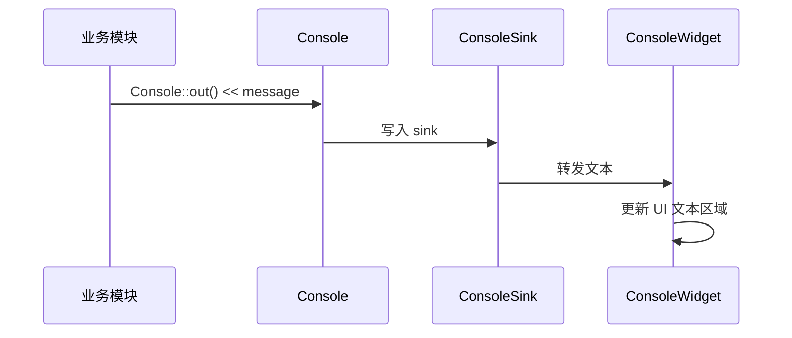

<!-- 本文件用于说明 src/console 模块的全局日志输出、sink 注册和控制台窗口流程。 -->

# console 模块逻辑说明

## 模块职责

`src/console` 为项目提供统一日志输出能力，负责：

- 提供 `Console::out()` 风格的输出接口
- 支持注册和注销日志 sink
- 将日志展示到 `ConsoleWidget`
- 为 USB、窗口生命周期和调试功能提供可视化输出

核心文件：

- `src/console/console.h`
- `src/console/console.cpp`
- `src/console/console_sink.h`
- `src/console/console_widget.h`
- `src/console/console_widget.cpp`

## 构建依赖

## 使用流程

## 日志输出链路

## 当前使用场景

| 调用方 | 日志内容 |
| --- | --- |
| `Kray` | 构造、关闭、析构、子窗口释放 |
| `USBWidget` | 设备枚举、热插拔、页面切换 |
| `UsbDeviceBase` | 打开、关闭、读写、异步读取 |
| `GT64HeWidget` | 设备打开、USB 调试收发、律动连接 |

## 当前状态

- 日志模块已经成为调试主通道。
- `_consoleWin` 当前由 `Kray` 文件级静态变量持有。
- 多个模块直接依赖 `Console::out()`。
- 日志级别、模块过滤和输出限流尚未实现。

## 改进建议

1. 增加日志级别，例如 debug、info、warn、error。
2. 增加模块标签过滤，例如 `[USB]`、`[Audio]`、`[Protocol]`。
3. 控制高频日志，避免连续 USB 读取或音频刷新时刷屏。
4. 将 `_consoleWin` 改成 `Kray` 成员或应用级服务对象。
5. 为 sink 生命周期增加防护，避免窗口销毁后仍有模块写日志。
