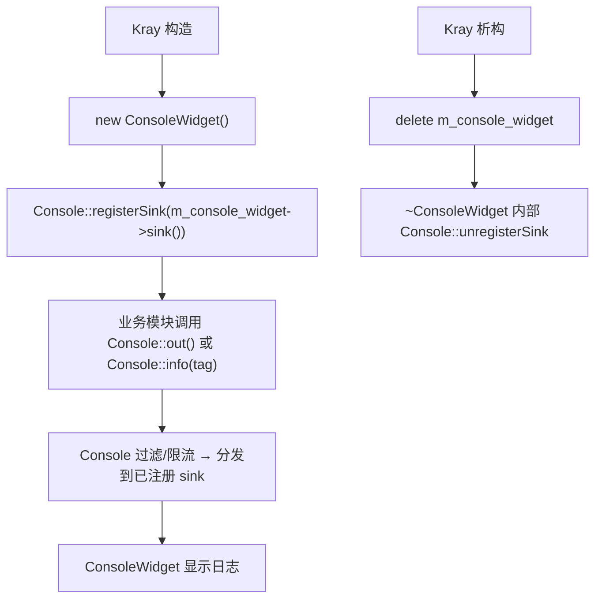
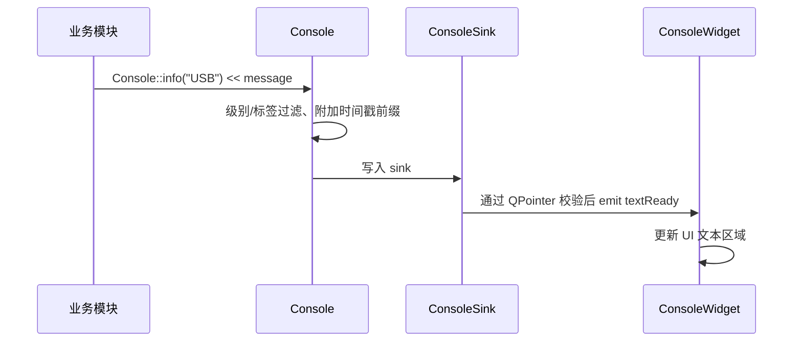

<!-- 本文件用于说明 src/console 模块的全局日志输出、sink 注册和控制台窗口流程。 -->

# console 模块逻辑说明

## 模块职责

`src/console` 为项目提供统一日志输出能力，负责：

- 提供 `Console::out()` 风格的输出接口
- 提供带级别 / 模块标签 / 限流的 `Console::log()` 接口族
- 支持注册和注销日志 sink
- 将日志展示到 `ConsoleWidget`
- 为 USB、窗口生命周期和调试功能提供可视化输出

核心文件：

- `src/console/console.h`
- `src/console/console.cpp`
- `src/console/console_sink.h`
- `src/console/console_widget.h`
- `src/console/console_widget.cpp`

## 构建依赖


## 使用流程



## 日志输出链路



## 接口概览

| 接口 | 说明 |
| --- | --- |
| `Console::out()` | 兼容旧调用，返回原始 ostream，不做过滤 |
| `Console::log(Level, tag)` | 主接口，返回临时 `LogStream`，自动加前缀 |
| `Console::debug/info/warn/error(tag)` | 各级别便捷工厂 |
| `Console::setMinLevel(Level)` | 设置全局最低输出级别 |
| `Console::setTagEnabled(tag, bool)` | 启用 / 禁用模块标签 |
| `Console::getTagEnabled(tag)` | 查询标签是否启用 |
| `Console::shouldLog(key, ms)` | 频率限流工具，同 key 在 ms 内只放行一次 |
| `Console::registerSink / unregisterSink / clearSinks` | sink 生命周期管理 |

输出格式：`[HH:MM:SS.mmm][LEVEL][TAG] message`，无 tag 时显示空标签 `[]`。

## 当前使用场景

| 调用方 | 日志内容 |
| --- | --- |
| `Kray` | 构造、关闭、析构、子窗口释放 |
| `USBWidget` | 设备枚举、热插拔、页面切换 |
| `UsbDeviceBase` | 打开、关闭、读写、异步读取 |
| `GT64HeWidget` | 设备打开、USB 调试收发、律动连接 |

## 推荐用法

```cpp
// 一般信息
Console::info("USB") << "device opened, vid=0x" << std::hex << vid;

// 错误
Console::error("Audio") << "open device failed: " << err.message();

// 高频日志使用限流，避免刷屏
if (Console::shouldLog("usb-bulk-read", 500)) {
    Console::debug("USB") << "bulk read " << n << " bytes";
}

// 调试期间临时关闭某模块输出
Console::setTagEnabled("Audio", false);

// 发布版本只输出 Warn 及以上
Console::setMinLevel(Console::Level::Warn);
```

## 当前状态

- 日志模块是调试主通道，旧接口 `Console::out()` 保持向后兼容。
- 控制台窗口由 `Kray::m_console_widget` 持有，生命周期与主窗口绑定。
- `ConsoleWidget` 析构会自动 `Console::unregisterSink`，并通过 `QPointer` 防止销毁后悬挂写入。
- `ConsoleWidget` 右键菜单提供"导出日志…"项，输出 UTF-8 文本文件。
- 日志级别、标签过滤、按 key 的高频限流均已就绪，业务模块可按需启用。

## 已落地的改进

1. 日志级别 debug / info / warn / error，统一前缀 `[TIME][LEVEL][TAG]`。
2. 模块标签过滤，通过 `Console::setTagEnabled` 动态启用 / 禁用。
3. 高频日志限流工具 `Console::shouldLog(key, intervalMs)`。
4. `_consoleWin` 已迁移为 `Kray::m_console_widget` 成员。
5. Sink 生命周期防护：`ConsoleWidget` 析构自动注销 sink，`WidgetSink` 内部使用 `QPointer` 防止悬挂调用。
6. 日志文本导出：控制台右键菜单 → "导出日志…"。

## 后续可选优化

- 业务模块逐步迁移到 `Console::info/warn/error(tag)`，让旧 `Console::out()` 成为兜底通道。
- 增加文件 Sink，用于长时间运行场景的滚动日志归档。
- 限流支持 token bucket 等更细粒度的策略。
