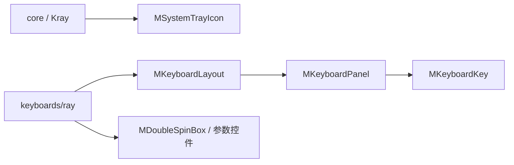
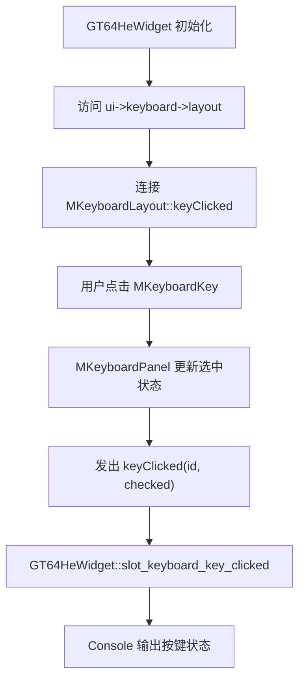
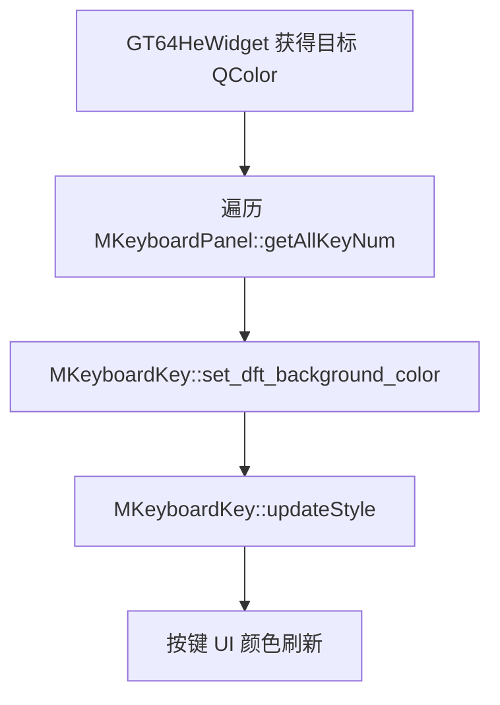
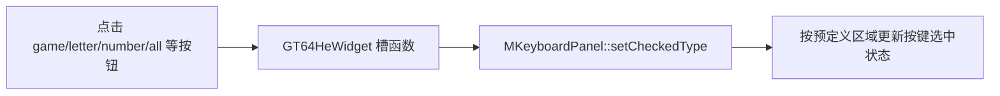

<!-- 本文件用于说明 src/elements 模块的自定义 Qt 控件和键盘布局组件逻辑。 -->

# elements 模块逻辑说明

## 模块职责

`src/elements` 存放项目自定义 Qt 控件，主要服务于主窗口、系统托盘和键盘可视化页面。

典型职责：

- 提供键盘面板、按键和布局组件
- 提供系统托盘封装
- 提供自定义滑块、SpinBox 等 UI 控件
- 支撑 GT-64HE 参数调试和按键选择交互

核心文件示例：

- `src/elements/MKeyboardLayout.h`
- `src/elements/MKeyboardKey.h`
- `src/elements/MKeyboardPanel.h`
- `src/elements/MSystemTrayIcon.h`
- `src/elements/MDoubleSpinBox.h`

## 模块关系

## 键盘 UI 交互流程

## 按键颜色更新流程

## 快速选择流程

## 当前状态

- 自定义控件承担了键盘 UI 的主要可视化能力。
- 键盘页面可以通过这些控件完成按键选择、颜色调试和样式刷新。
- 控件与 `GT64HeWidget` 耦合较深，很多内部成员通过 `ui->keyboard->layout->m_panel` 直接访问。

## 改进建议

1. 为 `MKeyboardLayout` 提供更稳定的公开 API，减少外部直接访问 `m_panel`。
2. 将“遍历全部按键”的回调封装成类型安全的 C++ 接口。
3. 为按键 ID、灯位 ID 和 UI 顺序建立明确映射文档。
4. 将颜色样式更新集中到一个样式管理方法，避免多个模块直接拼 style。
5. 对键盘布局组件增加独立测试或小型示例，方便调试 UI 行为。
