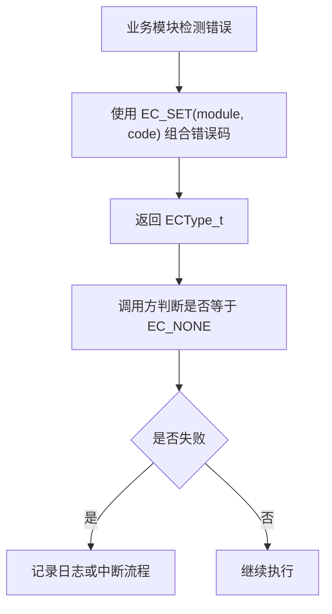
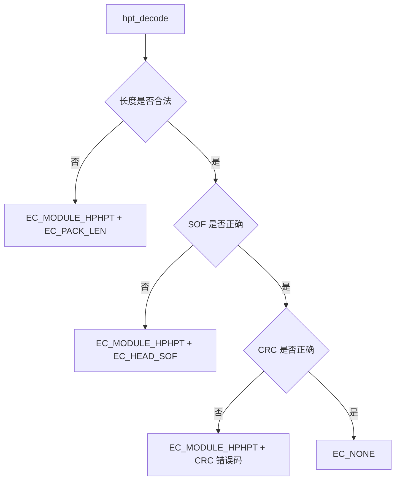

<!-- 本文件用于说明 src/utils 模块的错误码工具职责和在协议层中的使用方式。 -->

# utils 模块逻辑说明

## 模块职责

`src/utils` 当前主要提供基础错误码定义，供协议层等模块返回统一错误状态。

核心文件：

- `src/utils/ec.h`

## 依赖关系

## 错误码使用流程

## 在 HPHPT 中的使用

## 当前状态

- 工具模块很轻量，主要支撑错误码。
- 协议层已经通过 `EC_SET(EC_MODULE_HPHPT, code)` 组合模块错误码。
- 错误码到可读字符串的转换能力暂未看到完整封装。

## 改进建议

1. 增加错误码到字符串的转换函数，便于日志和 UI 展示。
2. 为每个模块分配稳定错误码范围，避免后续冲突。
3. 在协议、USB 和 UI 层之间统一错误处理策略。
4. 如果错误码会跨设备或协议传输，应明确字节序和字段宽度。
