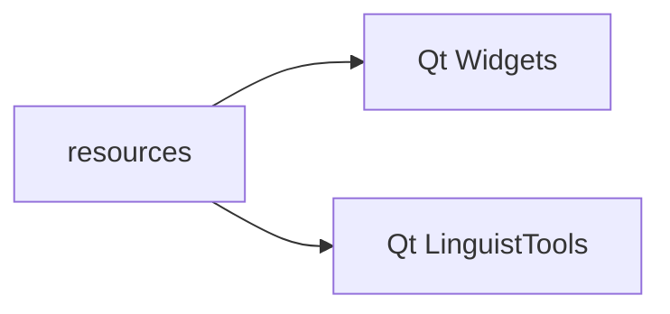
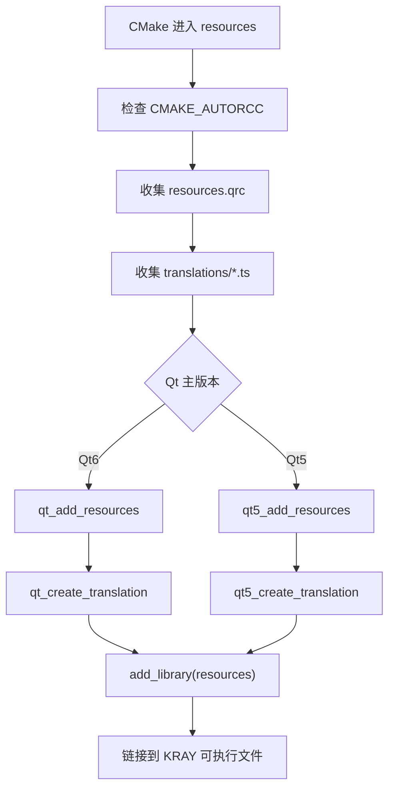
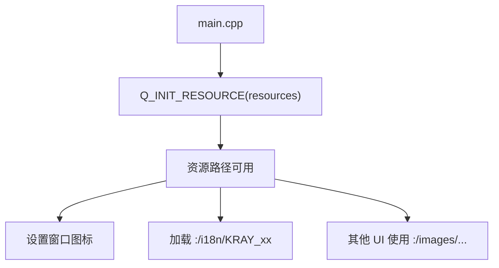

<!-- 本文件用于说明 resources 模块的 Qt 资源、图标和翻译文件构建流程。 -->

# resources 模块逻辑说明

## 模块职责

`resources` 模块负责将应用资源编译进 Qt 程序，主要包括：

- 图片、图标等静态资源
- Qt `.qrc` 资源索引
- 翻译 `.ts` 文件和生成的 `.qm` 文件
- 应用启动时通过 `Q_INIT_RESOURCE(resources)` 注册资源

核心文件：

- `resources/CMakeLists.txt`
- `resources/resources.qrc`
- `resources/translations/*`

## 构建依赖

## 构建流程

## 运行时加载流程

## 当前状态

- `main.cpp` 已调用 `Q_INIT_RESOURCE(resources)`。
- 主窗口和音乐窗口已使用资源图标。
- 翻译器加载逻辑已存在，但翻译覆盖度需要进一步确认。

## 改进建议

1. 在 README 中说明资源路径命名规范。
2. 建立图标和翻译资源清单，避免无用资源长期累积。
3. 检查 `.ts` 到 `.qm` 的生成结果是否被正确打包。
4. 如果资源变多，可按图片、翻译、主题拆分 qrc 文件。
