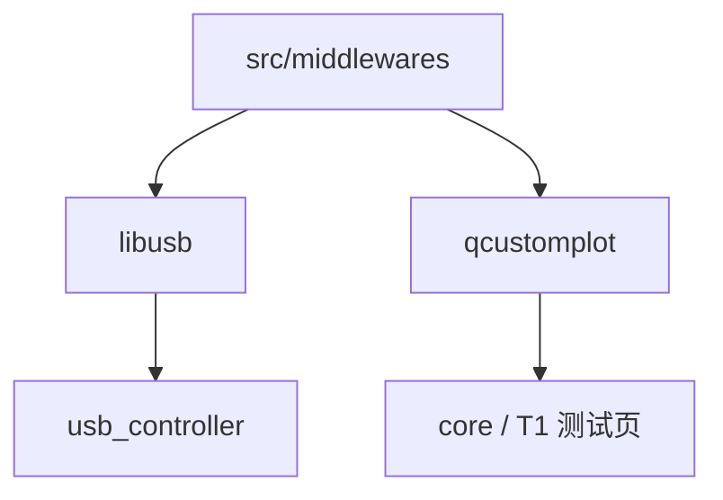

<!-- 本文件用于说明 src/middlewares 模块中第三方依赖的构建关系和使用位置。 -->

# middlewares 模块逻辑说明

## 模块职责

`src/middlewares` 存放第三方库和中间件代码，当前 CMake 接入的主要模块是：

- `libusb`：USB 底层依赖
- `qcustomplot`：Qt 图表组件

目录中还存在 `qt-material-widgets` 等第三方资源，但当前 `src/middlewares/CMakeLists.txt` 只添加了 `libusb` 和 `qcustomplot`。

## 构建关系

## libusb 使用流程

## qcustomplot 使用流程

## 当前状态

- `libusb` 是 USB 控制链路的关键依赖。
- `qcustomplot` 主要服务测试页或图表展示。
- `qt-material-widgets` 目录存在大量文件，但未在当前 CMake 中显式接入。
- 第三方代码和项目代码混放在 `src/middlewares` 下，需要明确维护边界。

## 改进建议

1. 在文档中标注每个第三方库的来源、版本和许可证。
2. 未接入构建的第三方目录应标注用途，或移出主源码树。
3. 避免直接修改第三方源码；如需修改，应记录补丁原因。
4. 为 `libusb` 的平台库路径和部署方式补充说明，降低新环境构建成本。
5. 如果 `qcustomplot` 只用于测试页，可考虑将其依赖范围限制到测试模块。
