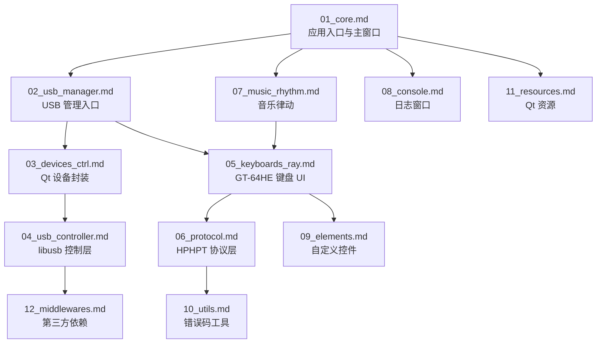
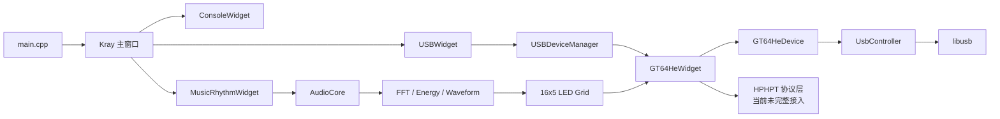

<!-- 本文件用于汇总 KRAY 项目的模块说明文档，并提供推荐阅读顺序。 -->

# KRAY 模块逻辑文档索引

本文档目录按项目当前 CMake 模块和核心业务边界拆分，每个模块文件都包含：

- 模块职责
- 依赖关系
- 核心逻辑流程图
- 关键调用链
- 当前状态
- 改进建议

## 推荐阅读顺序

## 模块文件列表

| 文件 | 模块 | 说明 |
| --- | --- | --- |
| `01_core.md` | `src/core` | Qt 应用入口、主窗口、子窗口生命周期 |
| `02_usb_manager.md` | `src/ui/usb_manager` | USB 设备列表、热插拔、进入键盘页面 |
| `03_devices_ctrl.md` | `src/ui/devices_ctrl` | Qt 层设备信息与设备基类 |
| `04_usb_controller.md` | `src/usb_controller` | libusb 封装、HID 打开、同步/异步传输、热插拔 |
| `05_keyboards_ray.md` | `src/ui/keyboards/ray` | GT-64HE 键盘 UI、调试、律动联动、灯效 |
| `06_protocol.md` | `src/protocol` | HPHPT 64 字节协议框架 |
| `07_music_rhythm.md` | `src/ui/music_rhythm` | miniaudio 采集、FFT、LED 网格映射 |
| `08_console.md` | `src/console` | 全局日志输出与控制台窗口 |
| `09_elements.md` | `src/elements` | 自定义 Qt 控件与键盘布局组件 |
| `10_utils.md` | `src/utils` | 错误码与基础工具 |
| `11_resources.md` | `resources` | Qt 资源、图标、翻译文件 |
| `12_middlewares.md` | `src/middlewares` | libusb、qcustomplot 等第三方依赖 |

## 项目主流程总览

## 总体改进方向

1. 将协议层从“框架占位”推进到“真实收发链路”：补齐 CRC、编码函数、命令回调，并在键盘页面接入。
2. 将设备识别从“任意 HID”改成“指定 VID/PID + 接口能力校验”。
3. 统一窗口生命周期管理，减少 `closeEvent`、析构函数和 lambda 中的重复手动 `delete`。
4. 将音乐律动与键盘页面的连接从顶层窗口遍历改成明确依赖注入或服务管理。
5. 把 UI 灯效预览进一步打通到物理键盘灯效下发。
